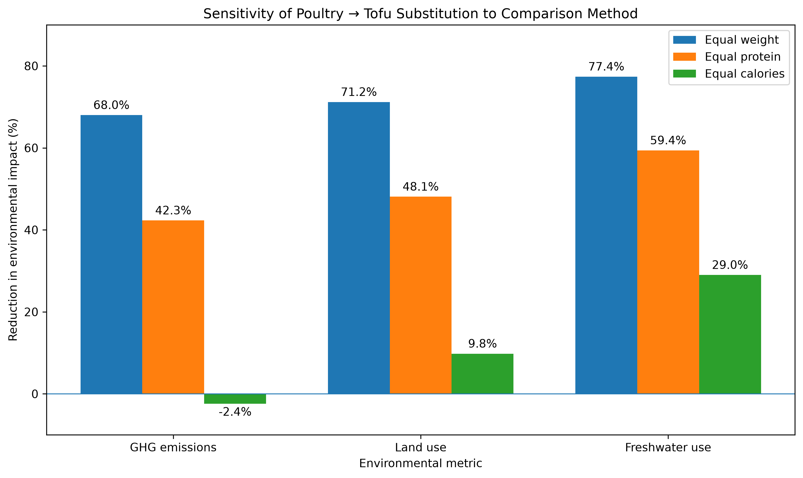

# Climate-Conscious Diet Data Analysis

A Python data analysis project investigating how dietary choices can reduce environmental impact without ignoring nutritional differences between foods.

I combined nutritional data with environmental data on greenhouse gas emissions, land use and freshwater withdrawals. I then constructed alternative metrics, compared environmental rankings, modelled realistic protein substitutions and tested how sensitive the resulting recommendations were to different assumptions about nutritional equivalence.

## Key Findings

- Beef was consistently the highest-impact protein source in the comparisons. On an equal-protein basis, replacing beef with poultry reduced greenhouse gas emissions by 90.1% and land use by 96.3%, while replacing beef with tofu reduced them by 94.3% and 98.1% respectively.

- Environmental metrics were related but not interchangeable. Spearman rank correlations between greenhouse gas emissions, land use and freshwater withdrawals ranged from 0.584 to 0.679, while individual foods could rank very differently depending on the metric used.

- Some recommendations were highly sensitive to the comparison method. Replacing poultry with tofu substantially reduced impact when foods were compared by equal weight or protein, but when equal calories were compared, their greenhouse gas emissions were approximately equal. In contrast, the benefits of replacing beef remained large across all three comparison methods.

## Methodology

I merged environmental and nutritional datasets by food type using Pandas. I constructed new metrics to compare environmental impact per unit of protein and calories, used Spearman rank correlation to compare environmental measures, modelled equal-protein food substitutions, and performed sensitivity analysis using equal-weight, equal-protein and equal-calorie comparisons.

Visualisations were produced using Matplotlib.

## Data

Environmental data: Our World in Data, based on Poore & Nemecek (2018), covering greenhouse gas emissions, land use and freshwater withdrawals.

Nutritional data: nutritionvalue.org, including protein and calorie content per 100g of food.

## Project Structure

- `01_protein_efficiency.py` — compares greenhouse gas emissions across high-protein foods on an equal-protein basis
- `02_environmental_metrics.py` — compares rankings across greenhouse gas emissions, land use and freshwater withdrawals
- `03_food_substitutions.py` — models the environmental effects of equal-protein substitutions between beef, poultry and tofu
- `04_sensitivity_analysis.py` — tests how results change under equal-weight, equal-protein and equal-calorie comparisons
- `report.md` — full analysis and discussion
- `data/` — source datasets
- `figures/` — generated visualisations

## Tools

Python · Pandas · Matplotlib

## Full Analysis

For the full methodology, results, interpretation and limitations, see [`report.md`](report.md).