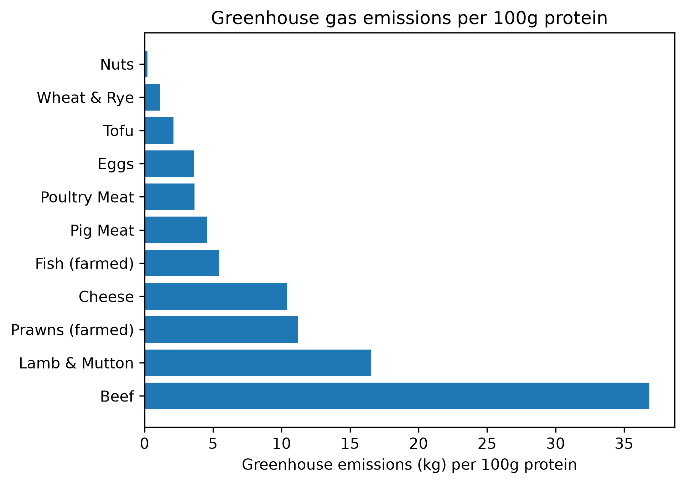
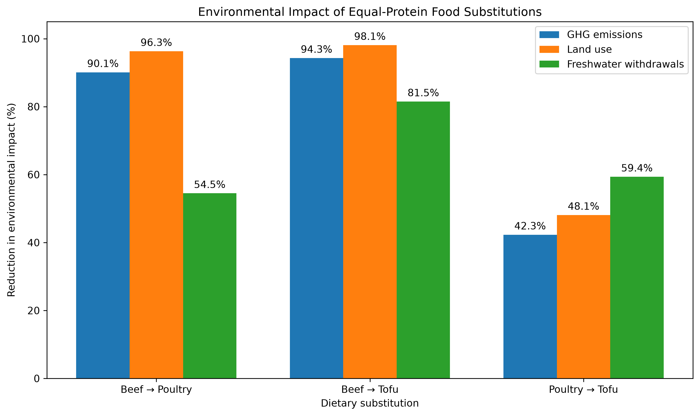

# Climate-Conscious Diet Data Analysis

## Which protein sources are the most climate-effective?

I built nutritional and environmental datasets with data from nutritionvalue.org and Our World in Data, Poore & Nemecek (2018) respectively. I merged these datasets and used them to create new useful metrics, such as "Greenhouse gas emissions per 100g protein", which this graph shows. The benefit of creating metrics that involve both datasets is that we can make conclusions that can realistically inform a diet, by taking into account both the nutritional satisfaction and the environmental impact assosciated with such diet.

I chose to make this specific graph on the greenhouse gas emissions per 100g protein because I observe a hyperawareness of people regarding their protein intake. You have surely noticed all the new "added protein" products popping up in shops, and it's because people have become very aware of the amount of protein they eat. Additionally, the most immediate response I hear to vegetarian or vegan diet changes is "what about protein?". So for these reasons I thought it useful to analyse the greenhouse emissions per unit protein of the common high protein foods in my dataset, which I defined as foods having more than 10g protein per 100g, which was a quantity I sorted for before making the graph.

The most visually striking part of the graph is the extent to which beef scores higher than any of the next highest options. It's associated emissions are more than double the next worse option, lamb, nearly 10x the emissions of poultry meat (e.g. chicken), and approximately 17x the emissions of tofu. The conclusion I would make from this is that, even if you are resistant to changing beef in your diet to vegan options like tofu, there are still vast meaningful positive changes that can be made by making changes to less emissions heavy protein sources like chicken, fish, eggs, etc.

Despite nuts being included in my sorting of "high protein foods", and coming out as having the least greenhouse emissions per 100g protein, it would not be suitable as a complete replacement for beef because nuts are extremely calorific so getting the same amount of protein from nuts as you were from other sources would not be advisable as part of a healthy balanced diet.

## Do different environmental metrics agree about which foods are environmentally preferable?
The first thing I did was calculate Spearman Rank coefficients between each metric:

The Spearman's coefficient between land and water usage is  0.679
The Spearman's coefficient between land usage and greenhouse gas emissions is  0.629
The Spearman's coefficient between water usage and greenhouse gas emissions is  0.584

This suggested that the metrics generally agree, with a moderate-to-strong positive agreement, but far from perfect. To check the instances where they disagreed the most, I sorted for the top five foods that differ the most in their environmental metrics, which are Nuts, Prawns (farmed), Rice, Beef, and Tofu. This was calculated by finding the standard deviation and the range of the ranking of each food per metric.

Nuts had a standard deviation of 8.79 and a range of 16.5. It's rankings are GHG 1.5|Land 15|Water 18. So, while it appears low by greenhouse gas emissions as the joint lowest polluting food source per kg in the dataset, it also ranks highly on water and land intensiveness, 18th and 15th worst respectively, so it would be incomplete to classify nuts has a low impact food based just on the greenhouse gas emissions.

Prawns are ranked GHG 17 | Land 7| Water 16  
Rice is ranked GHG 11 | Land 6 | Water 15  
Beef is ranked GHG 19 | Land 18 | Water 12  
Tofu is ranked GHG 10 | Land 8 | Water 4  

Therefore, despite moderate agreement as shown by the Spearman Rank coefficients, it would be innappropriate to conclude that the three metrics are interchangable. There is much more nuance to the environmental impact of foods when looking at each metric separately, because some foods are good by some metrics but worse by others. Looking at more metrics gives a better wholistic view

## What environmental benefit comes from realistic food substitutions?
Looking at some of the main available substitutions in our dataset, we consider the following three subsitutions and calculate the percentage change in each of the three environmental metrics we are looking at:

Beef → poultry: GHG −90.1%, land −96.3%, water −54.5%  
Beef → tofu: GHG −94.3%, land −98.1%, water −81.5%  
Poultry → tofu: GHG −42.3%, land −48.1%, water −59.4%  

The results suggest that substantial environmental improvements do not necessarily require completely removing meat from a diet. Replacing beef with poultry reduced greenhouse-gas emissions by 90.1% and land use by 96.3% on an equal-protein basis, capturing most of the reductions achieved by replacing beef with tofu. The reduction in freshwater use was smaller at 54.5%, again showing why considering multiple environmental metrics matters.

Replacing poultry with tofu produced further reductions across all three measures, but the additional improvement was much smaller for greenhouse-gas emissions and land use. This suggests that the largest environmental gain comes from moving away from particularly high-impact foods such as beef, rather than necessarily moving all the way from animal to plant-based protein. For someone unwilling to stop eating meat entirely, substituting beef for poultry could therefore still represent a significant and more achievable reduction in environmental impact.

## Do those conclusions survive if we change the assumptions behind the analysis?

The previous analysis compared protein sources on an equal-protein basis, but this assumes that protein is the appropriate measure of nutritional equivalence. To test how dependent the conclusions were on this assumption, I repeated the substitution analysis using three different comparison methods: equal weight, equal protein and equal calories.

Conditioning on impact per 100kcal:
Beef → poultry: GHG −90.5%, land −96.4%, water −56.0%  
Beef → tofu: GHG −90.3%, land −96.7%, water −68.8%  
Poultry → tofu: GHG +2.4%, land −9.8%, water −29.0%  

Conditioning on just per 100g:
Beef → poultry: GHG −90.1%, land −96.3%, water −89.7%  
Beef → tofu: GHG −96.8%, land −98.9%, water −54.5%  
Poultry → tofu: GHG -68.0%, land −71.2%, water −77.4%  

The conclusion that replacing beef substantially reduces environmental impact was robust to this choice. Beef-to-poultry and beef-to-tofu substitutions produced large reductions across greenhouse-gas emissions, land use and freshwater withdrawals under all three methods.

However, the comparison between poultry and tofu was much more sensitive. On an equal-weight basis, replacing poultry with tofu reduced GHG emissions by 68.0%, land use by 71.2% and freshwater withdrawals by 77.4%. On an equal-protein basis, these reductions fell to 42.3%, 48.1% and 59.4% respectively. When equal calories were compared, the reductions fell further to 9.8% for land and 29.0% for water, while GHG emissions actually increased slightly by 2.4%.

This happens partly because tofu is much less calorie-dense than poultry in the nutritional dataset, so substantially more tofu is required when calories rather than protein are held constant. The analysis therefore shows that some conclusions are much more robust than others. Moving away from beef consistently produces large environmental benefits, whereas the apparent advantage of tofu over poultry depends substantially on what nutritional quantity is being held constant.

More broadly, this reinforces a limitation that runs throughout the project: there is no completely neutral way to compare foods with different nutritional characteristics. The choice of denominator is itself an analytical assumption and can materially affect the recommendation.